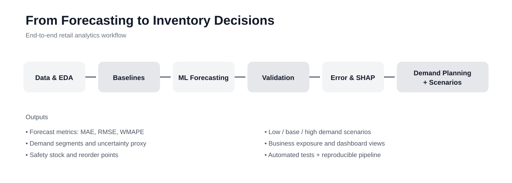
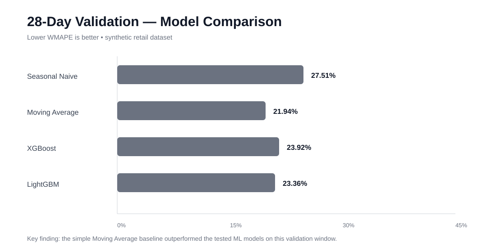
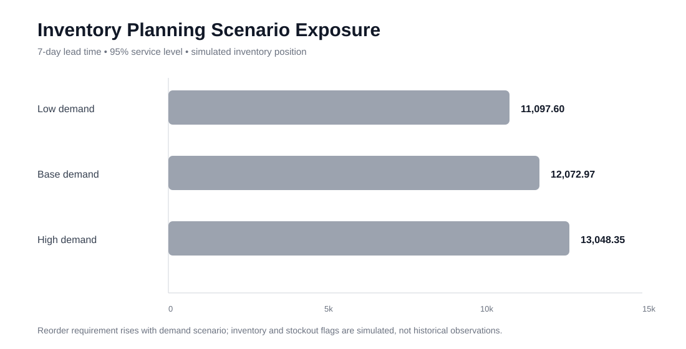

# Retail Sales Forecasting & Demand Planning

End-to-end time-series forecasting and machine-learning portfolio project using a synthetic M5-style retail dataset.

## Application-ready project snapshot

**Role:** Data Analyst / Data Science portfolio project  
**Domain:** Retail analytics, demand forecasting, inventory planning  
**Scale:** 224 item-store series across 3 years of daily data  
**Tools:** Python, Pandas, Scikit-learn, XGBoost, LightGBM, SHAP, Plotly, Streamlit, GitHub Actions

### Resume-ready achievements

- Built an end-to-end forecasting workflow across **224 item-store series** using EDA, feature engineering, statistical baselines and machine-learning models.
- Evaluated **4 forecasting approaches** with MAE, RMSE and WMAPE using chronological and walk-forward validation.
- Achieved **21.94% WMAPE** with a Moving Average baseline on the primary 28-day validation window, demonstrating that model complexity did not automatically improve performance.
- Reduced held-out test WMAPE from **49.04% to 40.65%** with a volume-aware hybrid forecasting policy combining ML forecasts and demand-specific fallbacks.
- Reduced low-volume WMAPE from **91.63% to 33.11%** in the same controlled experiment through demand segmentation and fallback forecasting.

### What this project demonstrates

**Data Analytics:** EDA, segmentation, KPI design, error analysis, business interpretation  
**Data Science:** time-series forecasting, feature engineering, model comparison, walk-forward validation, SHAP explainability  
**Business Analytics:** demand planning, safety stock, reorder points, scenario analysis  
**Engineering:** modular Python, automated tests, reproducible reporting, Streamlit dashboard, GitHub Actions

> **Data note:** This is a synthetic dataset structurally inspired by M5/Walmart-style retail forecasting. Forecasting and inventory results are portfolio experiments, not claims about a real retailer's historical performance.

## Business problem

Retailers need reliable short-term demand forecasts for inventory planning, replenishment, staffing and promotion decisions.

**Question:** How accurately can daily item-store sales be forecast 28 days ahead, and where do forecast errors concentrate?

## Workflow

Data validation → EDA → seasonality/decomposition → baselines → time-aware feature engineering → Random Forest/XGBoost/LightGBM → MAE/RMSE/WMAPE → walk-forward validation → error analysis → 28-day forecast → business recommendations → dashboard.

## Chronological split

- Train: 2023-01-01 to 2025-11-05
- Validation: 2025-11-06 to 2025-12-03
- Test: 2025-12-04 to 2025-12-31

The test feature file contains no target; actual test sales are stored separately.

## Validation result

The first benchmark is intentionally honest: the simple **Moving Average baseline outperformed the tree models on this synthetic dataset** during the 28-day validation window.

| Model | MAE | RMSE | WMAPE |
|---|---:|---:|---:|
| Seasonal Naive | 1.679 | 2.706 | 27.51% |
| Moving Average | **1.339** | **2.108** | **21.94%** |
| XGBoost | 1.604 | 2.907 | 23.92% |
| LightGBM | 1.567 | 2.772 | 23.36% |

This is an important analytical finding: model complexity is not automatically an improvement. The project now includes walk-forward evaluation utilities so model selection can be checked across multiple chronological windows rather than one validation period.

## Walk-forward validation

`src/walk_forward.py` provides:

- Multiple chronological forecast windows
- 28-day horizons by default
- Seasonal-naive evaluation without future-data leakage
- Window-level MAE, RMSE and WMAPE
- Mean and standard deviation across windows

Run:

`python -m src.run_walk_forward`

The runner writes:

- `reports/walk_forward_windows.csv`
- `reports/walk_forward_summary.csv`

These outputs are intended to support a more defensible model-selection decision before the final test forecast.

## Feature engineering

- Lag 1/7/14/28
- Rolling mean 7/14/28
- Rolling standard deviation 28
- Day-of-week and month cyclical features
- Store, state, item, department and category
- Price and economic/weather variables
- Event/SNAP indicators

## EDA utilities

`src/eda.py` provides reusable summaries for:

- Dataset coverage and dimensions
- Daily demand
- Product category demand
- Store demand
- Weekday demand patterns

This keeps the exploratory analysis reproducible instead of relying only on notebook screenshots.

## Error analysis

The project includes breakdowns by store, category, product and forecast horizon, plus feature-importance outputs for XGBoost and LightGBM.

## 28-day forecast

A Seasonal Naive 28-day forecast is included as a transparent benchmark for the unseen test period. On the held-out test period it produced:

- MAE: **3.091**
- RMSE: **5.380**
- WMAPE: **48.94%**

The benchmark is intentionally separated from the validation model-selection result.

## Engineering quality

- Modular Python
- Automated tests
- Leakage-aware chronological splitting
- Walk-forward validation
- Reproducible metrics
- CSV reporting artifacts
- Streamlit dashboard scaffold

## Dataset note

The data is synthetic and structurally inspired by M5/Walmart-style retail forecasting. It is not Walmart proprietary data.

## Flagship layer

The project now extends beyond a single train/validation benchmark into a portfolio-style forecasting workflow.

### EDA and visual analysis
`src/flagship_analysis.py` generates reproducible views for daily sales trend, weekly and monthly seasonality, store and category comparisons, price vs sales, and event effects.

### Walk-forward validation
Three historical 28-day windows are evaluated chronologically. The current Seasonal Naive baseline produced:

| Window | MAE | RMSE | WMAPE |
|---|---:|---:|---:|
| 2025-09-01 → 2025-09-28 | 1.742 | 2.606 | 26.11% |
| 2025-10-06 → 2025-11-02 | 1.730 | 2.643 | 27.59% |
| 2025-11-06 → 2025-12-03 | 1.679 | 2.706 | 27.51% |

The variation across windows is evidence that model quality should not be judged from one holdout period.

### Model improvement
A log-target XGBoost configuration was tested against the original validation window. Its validation WMAPE was 25.08%, compared with 23.92% for the earlier XGBoost configuration and 21.94% for the Moving Average baseline. This does not replace the baseline; it demonstrates that target transformation is an experiment, not an assumed improvement.

The final 28-day recursive log-XGBoost test forecast produced MAE 3.268, RMSE 4.719 and WMAPE 49.04% on the synthetic held-out test period.

### SHAP explainability
`src/shap_analysis.py` produces a SHAP beeswarm plot and ranked mean absolute SHAP values. In the sampled data, lag features—especially lag 7, lag 14, lag 1 and lag 28—were the strongest contributors, followed by category/store and calendar/economic variables.

### Forecast diagnostics
The flagship workflow includes aggregate actual-vs-predicted 28-day analysis, horizon-level WMAPE, recursive multi-step forecasting, and a direct multi-step forecasting implementation for controlled comparison.

### Dashboard
The Streamlit dashboard is designed around the hiring-manager view: Sales → Forecast → Error → Store → Category → Business implication.

Run locally with: `streamlit run dashboard/app.py`

The project intentionally keeps the Moving Average baseline visible. Model complexity is treated as an experiment that must be justified by measured improvement.

## Portfolio hardening layer

### Direct vs recursive forecasting
The multi-step experiment now uses the same feature matrix, log-target transformation, and XGBoost configuration for both strategies. Because fitting 28 independent direct models is computationally expensive on this multi-series dataset, the controlled portfolio benchmark evaluates operational checkpoints at **1, 7, 14 and 28 days**.

| Strategy | Horizon | MAE | RMSE | WMAPE |
|---|---:|---:|---:|---:|
| Direct | 1 | 2.882 | 4.486 | 48.21% |
| Recursive | 1 | 2.858 | 4.446 | 47.81% |
| Direct | 7 | 2.830 | 4.008 | 49.17% |
| Recursive | 7 | 2.748 | 4.004 | 47.76% |
| Direct | 14 | 2.623 | 3.476 | 46.55% |
| Recursive | 14 | 2.499 | 3.521 | 44.36% |
| Direct | 28 | 2.866 | 4.208 | 49.12% |
| Recursive | 28 | 2.914 | 4.201 | 49.94% |

This is presented as an experiment rather than a universal winner: performance changes with forecast horizon.

### Low-volume and intermittent-demand handling
Series are segmented using historical demand only. The test experiment applies:
- **Low volume:** 7-day moving-average fallback.
- **Intermittent demand:** zero-demand policy when historical zero-rate reaches the configured threshold.
- **Medium/high volume:** retain the ML forecast.

On the held-out synthetic test set, the volume-aware hybrid produced **MAE 2.709, RMSE 4.453 and WMAPE 40.65%**, compared with **49.04% WMAPE** for the recursive log-XGBoost forecast before the volume policy. Low-volume WMAPE improved from **91.63% to 33.11%** in the same experiment.

The policy is intentionally simple and is included to demonstrate demand-segmentation thinking, not to claim that a single fallback rule is optimal for every retail environment.

### Dashboard
The Streamlit dashboard is now structured as a portfolio front door:
- Executive view
- Forecast diagnostics
- Direct vs recursive model lab
- Demand segmentation
- Methodology

It includes interactive store/category/horizon filtering when the forecast output is present, KPI cards, Plotly charts, and concise business interpretation.

Run with:
`streamlit run dashboard/app.py`

### Reproducibility
Place the synthetic CSV files under `data/`, then run the analysis modules to regenerate reports. The dashboard reads the generated report files rather than embedding analysis logic in the UI.

## Visual overview

### End-to-end workflow

### Validation performance

### Demand-planning scenarios

## Advanced demand planning

The project now converts forecast diagnostics into inventory-planning decisions at the item-store level.

### Demand profiling
Historical demand is profiled using:
- Mean and standard deviation of daily demand
- Total demand and zero-demand rate
- Coefficient of variation
- Recent-vs-early 28-day demand
- Trend ratio
- Volume and demand-behavior segments

Segmentation is history-only and is designed to support differentiated planning rather than applying one rule to every series.

### Uncertainty proxy
The planning layer summarizes historical forecast-error behavior using a 7-day seasonal-naive error proxy:
- MAE
- Error standard deviation
- P90/P95 absolute error

This is explicitly an **uncertainty proxy**, not a calibrated probabilistic forecast.

### Inventory policy
The planning simulation uses:
- 7-day lead time
- 95% service level
- z = 1.645
- Recent 28-day mean as baseline planning demand
- Error-standard-deviation proxy for safety stock
- Reorder point = expected lead-time demand + safety stock
- Low/base/high demand scenarios using 0.90/1.00/1.10 multipliers

Because the dataset does not contain observed inventory, purchase orders, or historical stockout records, inventory position is simulated at 7 days of baseline demand. The resulting stockout-risk flags are therefore **policy-simulation outputs, not claims of historical stockouts**.

### Scenario exposure
The current synthetic-data run produces 224 item-store series. Under the stated simulation assumptions:

| Scenario | Simulated inventory | Reorder requirement | Stockout-risk flags |
|---|---:|---:|---:|
| Low demand | 9,753.75 | 11,097.60 | 224 |
| Base demand | 9,753.75 | 12,072.97 | 224 |
| High demand | 9,753.75 | 13,048.35 | 224 |

These results demonstrate how forecast uncertainty can be translated into replenishment requirements and scenario exposure. They should not be interpreted as evidence that the underlying synthetic retailer historically experienced stockouts.

### Reproduce the full workflow

From the `retail-sales-forecasting` directory:

\`\`\`bash
python run_all.py
\`\`\`

The one-command pipeline runs:
1. Flagship EDA and baseline analysis
2. Walk-forward validation
3. Advanced demand planning

Planning-only execution:

\`\`\`bash
python -m advanced_demand_planning.src.run_planning
\`\`\`

Dashboard:

\`\`\`bash
streamlit run dashboard/app.py
\`\`\`

The integrated dashboard includes forecast diagnostics, demand segmentation, uncertainty summaries, reorder-point scenarios, and business-exposure views when the planning reports are available.

### Engineering and testing

The project includes automated unit tests covering metrics, feature engineering, walk-forward logic, volume segmentation, pipeline orchestration, and demand-planning modules. GitHub Actions runs the test suite on changes to the retail forecasting project.
